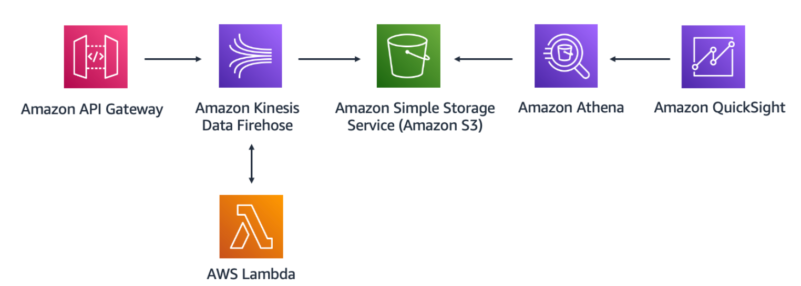

Purpose: Creating a cloud native querying and data analytics solution for analyzing healthcare data.

**In Scope:**

- API-Gateway: Creating an API-Gateway for the endpoint where the health data/vitals frontend will send the data.

- Kinesis Data Firehose: A data ingestion mechanism will be included within the architecture to integrate with API-Gateway so that data can be ingested, minimally transformed, and aggregated. If ingestion of data is required in real-time like person health vitals/click stream data, a service that quickly ingests and aggregates that data is required. Kinesis Data Firehose is an AWS service that ingests and slightly transforms the data.

- S3: An object storage will also be included within the architecture to store the data that is sent from Kinesis Firehose.

- AWS Lambda: A Lambda function will be created that will be triggered when data is ingested by the Firehose stream to perform one further transformation before it is sent to the S3 bucket.

- Querying: An Athena table will be created for querying the data.

- Hosting: The Frontend will be hosted on AWS Amplify.

- Payload will be sent to the endpoint via three methods:
  - Payload sent to the end via API-Gateway test.
  - Post Man (application that allows testing of web APIs) will also be used to send payload in JSON.
  - A Front end has been created to send the data over to the endpoint.
  - A url link for a responsive webpage will be shared to enter and submit synthetic health data/vitals.
- Data Analytics: Amazon QuickSight will be pointed to the Athena table and health data/vitals will be analyzed.

- Demonstrate how services in the cloud can be connected to State native tools like Tableau.

**Out of Scope:**

- Create organized, aesthetically pleasing and meaningful data visualizations.
